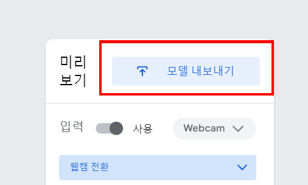
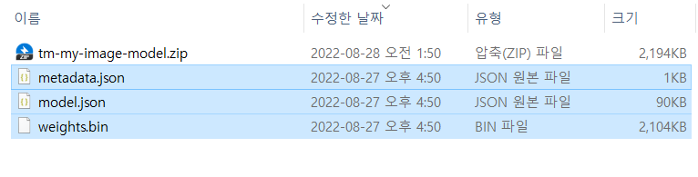
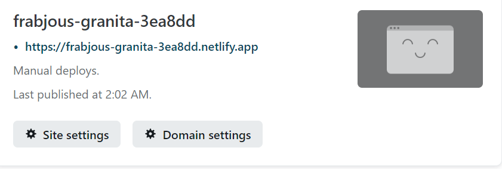

## 직접 만들어 보는 인공지능

1. 티쳐블 머신 접속 [**(링크)**](https://teachablemachine.withgoogle.com/train/image)

   

   

2. 인공신경망 모델 학습 및 완료된 모델 다운로드

   - **웹캠**으로 직접 이미지를 촬영하거나, **샘플 이미지를 업로드**할 수 있습니다.

   - Class 1, Class 2 에 **적절한 명칭을 기입**합니다.

   - **"모델 학습시키기"** 버튼을 눌러 신경망 모델을 학습시킵니다.

   - **"모델 내보내기"** 버튼을 클릭합니다.

   - 

   - **"다운로드"** 버튼 클릭 후 **"모델 다운로드"** 버튼을 클릭합니다.

   - 

   - 임의의 디렉토리에 .zip 파일을 **다운로드** 받습니다.

     

     

3. 다운로드 받은 .zip 파일을 압축을 해제 합니다.

   - 다음과 같이 3개의 파일이 압축 파일에 포함되어 있습니다. (metadata.json, model.json, weights.bin)
   - 

4. `my_model` 폴더 생성 후 이전 단계에서 압축을 풀어준 3개의 파일을 폴더 안으로 이동합니다.

   - 단, `my_model` 폴더명은 **전부 소문자** 이어야 하며, **스펠링 오타가 없어야** 합니다.

     

   - `my_model` 폴더 안에는 이전에 압축을 풀어준 3개의 파일을 위치합니다.

     

     

5. 아래의 다운로드 링크에서 `index.html` 파일을 다운로드 합니다.

   - index.html [**(다운로드)**](https://www.dropbox.com/s/bjrq87r2k48d94x/index.html?dl=1)

   - 다운로드 받은 파일은 이전에 생성한 `my_model` 폴더와 같은 위치에 위치 시킵니다.

     

     

6. 모델 배포하기

   - https://app.netlify.com/ 에 접속하여 간단한 회원가입 절차를 진행합니다.

   - 대시보드에서 "Sites" - "Deploy Manually" 공간에 폴더를 Drag & Drop 합니다.

     

     

   - "Your site is deployed" 메시지를 확인 합니다.

     

   - 상단에 자동으로 생성된 URL을 클릭합니다.

     

     

     

