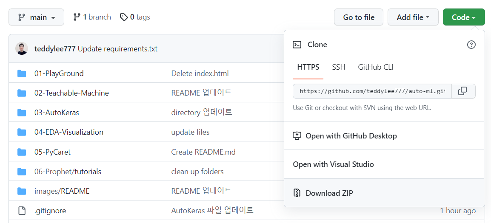

# 자동 머신러닝 도구 튜토리얼 

"This repository is an ULTIMATE TUTORIALS for different frameworks of AutoML"

입문자를 위한 튜토리얼이며, 튜토리얼 진행을 위해서 Python 기본 문법은 알고 있어야 합니다.


----

### 설치(Installation)

본 튜토리얼 **Repository를 복제(Clone)** 하거나 **"Download ZIP"**으로 내려 받습니다.




아나콘다 가상환경 및 Python 설치 [**(링크)**](https://www.anaconda.com/products/distribution)

- [참고] 아나콘다 가상환경 설치 관련 블로그 글 [**(링크)**](https://teddylee777.github.io/python/anaconda-%EA%B0%80%EC%83%81%ED%99%98%EA%B2%BD%EC%84%A4%EC%A0%95-%ED%8C%81-%EA%B0%95%EC%A2%8C)


`automl` 가상환경을 설치 합니다.

- (Windows) anaconda prompt 열기
- (Mac OS) "Terminal" 열기

```bash
conda create -n automl python=3.8
```


생성한 **가상환경에 진입**합니다.

> Windows

```bash
conda activate automl
```

> MacOS

```bash
source activate automl
```


`requirements.txt`에 설정된 패키지들을 **일괄 설치** 합니다.

```bash
pip install -r requirements.txt
```


